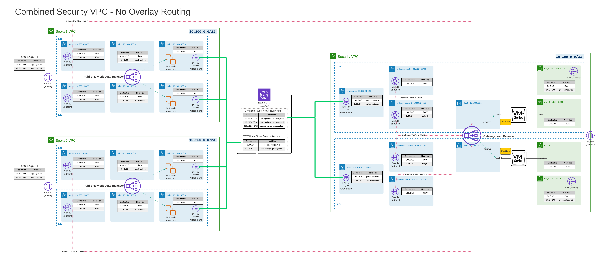

# Palo Alto Firewall Deployment with Gateway Load Balancer

## Deployment Scenarios

1. **Full Deployment**:
    - Use the `full-deploy` folder if the VPC has not been built.

## Topology Diagram

## After Deployment

1. **Setup Spoke VPCS**:
    - Traffic is intrazone by default, and Fortigate allows intrazone traffic. Use security groups to isolate traffic as needed.
    - Spokes should connect to the txgw, with routing handled automatically. Ensure the spoke has a default route to the txgw for private subnets.
    - For public ingress access in spoke subnets:
      - Devices on the public subnet must have public IPs. Use a load balancer if possible.
      - Create a subnet in each AZ for the gateway load balancer endpoints with routes to the IGW and VPC CIDR.
      - Create an ingress subnet/route table attached to the IGW with routes to the appropriate gwlbe for each AZ.
      - Create a public subnet and route table per AZ with routes to the appropriate GLBE and VPC CIDR. Add routes to the transit gateway if needed.
      - Create additional route tables/subnets for private workloads with routes to the txgw.

